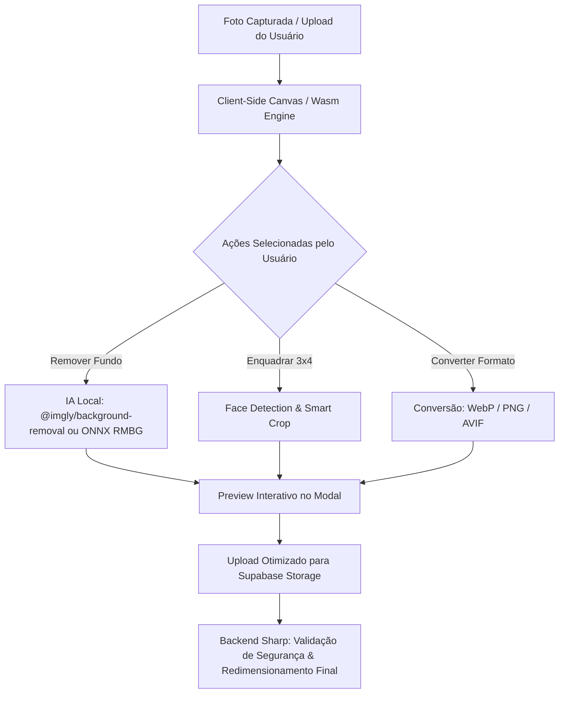

# Planos Futuros & Status de Implementação

Este arquivo armazena planos de implementação, ideias e melhorias estruturados para execução futura.
Atualizado automaticamente com o status real do repositório.

**Última atualização:** 2026-08-19

---

## 🗺️ Painel de Status Geral

| Plano | Status | Observação |
|-------|--------|------------|
| Filtro de Mapa Logístico, Camadas e Impressão | ✅ Implementado | Sessão 2026-07-28 — Filtros de camadas em `MapaGlobal.tsx`, `MapaAlunos.tsx`, `relatorios/page.tsx` e impressão com `MapaImpressao.tsx` e `print-relatorio-geolocalizacao.tsx` |
| Importador Inteligente de Alunos via Excel | ✅ Implementado | Sessão 2026-07-28 — Modal `modal-importar-excel.tsx` e utilitário `excelStudentParser.ts` para carga em massa |
| Sistema de Expurgo Seguro & Auditoria da Lixeira | ✅ Implementado | Sessão 2026-07-28 — Rotas de hard-delete `/api/admin/hard-delete`, `archive-agent.ts`, `audit-agent.ts` e gestão em `/admin/lixeira` |
| Otimização de Exportações de Banco & Painel do Chefe | ✅ Implementado | Sessão 2026-07-28 — Rota `/api/admin/export`, otimizações SQL/UI em `/admin/banco` e `/painel-chefe` |
| Módulo de Transporte Escolar Completo | ✅ Implementado | Sessão 2026-07-23 — Tabelas SQL, 5 abas em `/admin/transporte`, modais de combustível, manutenção e alocação de alunos |
| Módulo Secretário de Educação & Limpeza Boletim | ✅ Implementado | Sessão 2026-07-23 — Tabela `configuracoes_rede`, modal `/admin/escolas`, integração boletim e remoção placeholder |
| Integração Resend + Primeiro Acesso | ✅ Implementado | Sessão 2026-07-21 — Tela `/primeiro-acesso`, integração no `proxy.ts`, `PerfilTab.tsx` e `login/page.tsx` |
| Verificação QR Code / Crachá de Funcionário | ✅ Implementado | Sessão 2026-07-20 — Rota pública `/verificar/funcionario/[id]` com validação instantânea |
| Ajuste de Mapas e Geolocalização | ✅ Implementado | Sessão 2026-07-22 — Tiles Leaflet atualizados com fallbacks resilientes (`MapaAlunos`, `MapaAuditoria`, `MapaGlobal`, `MiniMapa`) |
| Contas Especiais & Portal EJA | ✅ Implementado | Sessão 2026-07-29 — Flag `is_conta_eja`, portal dedicado em `/eja`, isolamento de modalidades em relatórios, turmas e redirecionamento |
| Portal do Aluno / Responsáveis | ✅ Implementado | Sessão 2026-08-14 — Schema SQL, RLS blindado, toggle no Super Painel, menu dinâmico na Sidebar da Secretaria, gestão em `/responsaveis`, login próprio, troca de senha e dashboard em `/portal-aluno` |
| Compressão Segura de Fotos (Funcionários & Alunos) | ✅ Implementado | Sessão 2026-08-19 — Normalização client-side (fotos até 20MB -> ~2MB), bypass Vercel 4.5MB com upload direto assinado, variantes WebP 3x4 via Sharp no backend, validação ABAC/RLS e unificação nas fichas de Alunos e Funcionários |
| Módulo Roteiro e Paradas (Motoristas Nível 6) | ⏳ Pendente | Proposto em 2026-07-23 — Roteiro de paradas, geolocalização e confirmação de embarque/desembarque de alunos para contas nível 6 |
| Assistente de IA para Logs de Auditoria | ⏳ Pendente | Proposto em 2026-07-20 — Assistente para responder sobre histórico de auditoria no sistema |
| Acesso Rápido por Biometria Mobile (WebAuthn / Passkeys) | ⏳ Pendente | Proposto em 2026-08-15 — Autenticação biométrica rápida (Face ID / Digital) via WebAuthn/FIDO2 no celular |
| Estúdio de Imagens IA & Conversão Autônoma (Zero SaaS) | ⏳ Pendente | Proposto em 2026-08-19 — Remoção de fundo por IA client-side (Wasm/ONNX), conversão multiformato (WebP/PNG/AVIF) e enquadramento 3x4 automático com custo zero e LGPD |
| Otimização `/configuracoes` (40KB → 8-12KB) | ✅ Implementado | Sessão 2026-07-18 — Código modularizado, corrigidos 8 erros silenciosos |
| Refatoração e Otimização `modal-aluno.tsx` | ✅ Implementado | Sessão 2026-07-18 — Código modularizado com context/hooks, corrigidos 3 erros silenciosos |
| Refatoração e Otimização `modal-funcionario.tsx` | ✅ Implementado | Sessão 2026-07-18 — Código modularizado com context/hooks, dividido em 6 abas de formulário |
| Tabs Geolocalização (Funcionários + Alunos) | ✅ Implementado | Sessão 2026-07-18 — `MapaAlunos.tsx` criado, `MapWrapper` e `relatorios/page.tsx` modificados |
| Otimização Página de Ajuda | ✅ Implementado | Sessão 2026-07-18 — 8 gargalos + 7 erros silenciosos corrigidos |
| Otimização de Telas e Listagens (Alunos/Funcionários) | ✅ Implementado | Sessão 2026-07-18 — Imports dinâmicos (`dynamic` sem SSR) para modais pesados e try/catch com toasts |
| Skill `otimizador` | ✅ Implementado | Sessão 2026-07-18 — skill criada em `.agents/skills/otimizador/` |

---

## 📌 Integração do Resend + Troca Obrigatória de Senha (Primeiro Acesso)

> **Status:** ✅ Implementado  
> **Concluído em:** 2026-07-21  
> **Arquivos criados/modificados:** `[NEW] src/app/(auth)/primeiro-acesso/page.tsx` · `[MODIFY] src/proxy.ts` · `[MODIFY] src/app/(auth)/login/page.tsx` · `[MODIFY] src/app/(dashboard)/configuracoes/PerfilTab.tsx`  

### Checklist de Execução
- [x] Usuário configura SMTP com Resend no painel do Supabase
- [x] Usuário executa SQL de isenção dos usuários atuais (`primeiro_acesso = false`)
- [x] Criar página `/primeiro-acesso` (bloqueante, sem botão fechar)
- [x] Integrar interceptação no `proxy.ts` e redirecionamento no login
- [x] Integrar troca de senha no `PerfilTab.tsx`
- [x] Verificar com `npx tsc --noEmit`

---

### 1. Integração do Resend (SMTP no Supabase)

Para direcionar os disparos de e-mail do Supabase através do Resend:

#### Passos de Configuração (Manual pelo Usuário):
1. **Criar conta no Resend**: Acessar [resend.com](https://resend.com) e criar uma conta gratuita.
2. **Adicionar e Verificar Domínio**: No painel do Resend, adicionar o domínio próprio da aplicação e configurar os registros DNS (SPF, DKIM, TXT) no provedor de domínio (ex: Registro.br, Cloudflare).
3. **Gerar API Key**: No Resend, gerar uma nova API Key com permissão de envio.
4. **Configurar no Supabase**: Acessar o Dashboard do Supabase -> *Project Settings* -> *Auth* -> *SMTP Settings*:
   - **Sender email**: `noreply@seu-dominio.com.br` (ou o remetente verificado no Resend)
   - **Sender name**: Nome do seu sistema (ex: `SIG - Portal Escolar`)
   - **SMTP Host**: `smtp.resend.com`
   - **SMTP Port**: `465` (SSL) ou `587` (TLS)
   - **SMTP Username**: `resend`
   - **SMTP Password**: A API Key gerada no Resend

---

### 2. Isenção dos Usuários Atuais

Para garantir que os usuários atuais **não** vejam o modal de alteração de senha:

#### Comando SQL (Executar no SQL Editor do Supabase)
Definiremos a coluna `primeiro_acesso` de todos os funcionários atuais como `false`.
```sql
UPDATE public.funcionarios
SET primeiro_acesso = false;
```
*Novos funcionários criados futuramente herdarão o default `true` definido na estrutura da tabela.*

---

### 3. Fluxo de Troca de Senha Obrigatória no Primeiro Acesso

#### Comportamento Esperado:
1. Quando um novo usuário fizer login, a aplicação carregará os dados do funcionário vinculado (`public.funcionarios`).
2. Se `primeiro_acesso` for `true`, a aplicação exibirá um modal interceptor (bloqueante) exigindo a alteração de senha.
3. O modal **não** terá botão de fechar (`X`), nem fechará ao clicar fora. A única saída será definir uma nova senha válida.
4. Ao submeter a nova senha com sucesso (via Supabase Auth API), atualizaremos a coluna `primeiro_acesso` para `false` na tabela `public.funcionarios` para o funcionário logado.

---

### 4. Varredura de Erros Silenciosos e Mitigações

Identificamos os seguintes riscos de erros lógicos, segurança ou UX (edge cases) e suas respectivas soluções preventivas:

#### A. Bypass de Modal via Inspecionar Elemento (Inspect Element / F12)
*   **Risco Silencioso:** Um usuário malicioso ou curioso pode abrir o console do navegador, inspecionar o modal do Shadcn e deletá-lo do DOM (ou alterar o CSS `display: none` / `pointer-events`) para navegar pelo dashboard sem trocar a senha padrão.
*   **Mitigação:** 
    1. A verificação de `primeiro_acesso` também será validada em nível de layout principal (`layout.tsx`). Se `primeiro_acesso === true`, não apenas o modal será renderizado, mas todo o conteúdo da dashboard abaixo dele ficará oculto/não renderizado na árvore do React (`{primeiroAcesso ? <FirstAccessModal /> : <DashboardContent />}`). Assim, mesmo excluindo o modal via F12, o usuário só verá uma tela cinza vazia e sem dados.

#### B. Falha de Permissão RLS ao Atualizar `primeiro_acesso`
*   **Risco Silencioso:** Se a RLS da tabela `funcionarios` estiver configurada para impedir atualizações por usuários de nível básico (ou apenas para RH/Admin), a tentativa do usuário logado de atualizar seu próprio campo `primeiro_acesso` falhará com erro `42501` (permissão negada) ou de forma silenciosa, fazendo com que ele fique preso no loop do modal.
*   **Mitigação:** Criaremos um Endpoint de API / Route Handler dedicado em `src/app/api/auth/complete-first-access/route.ts` que utiliza o `supabaseAdmin` (cliente com bypass de RLS via Service Role) para realizar essa atualização com segurança. O endpoint validará primeiro se a sessão do usuário é legítima e se o ID bate com o dele antes de realizar o update no banco.

#### C. Recarregamento de Página ou Abas em Paralelo
*   **Risco Silencioso:** Se o usuário abrir o sistema em duas abas do navegador ao mesmo tempo, trocar a senha na Aba A (o que define `primeiro_acesso = false`), mas a Aba B continuar aberta exibindo o modal interceptor.
*   **Mitigação:** O modal utilizará o estado de sincronização global ou fará uma validação rápida do status no estado do Zustand. No entanto, recarregar a página resolve instantaneamente. Também podemos escutar mudanças no localStorage ou recarregar os dados do perfil quando o componente focar novamente.

---

### 5. Arquivos Propostos a Alterar/Criar

- **[NEW] Route Handler:** `src/app/api/auth/complete-first-access/route.ts`
- **[NEW] Modal Component:** `src/components/modals/first-access-modal.tsx`
- **[MODIFY] Layout:** `src/app/(dashboard)/layout.tsx` (integração e interceptação)

---

## 📌 Portal do Aluno / Responsáveis

> **Status:** ⏳ Pendente — Nenhum arquivo criado no repositório  
> **Planejado em:** 2026-07-18  
> **Confirmado ausente:** `portal-aluno/`, `responsaveis/`, `ModalCadastroResponsavel`, Edge Functions `criar-responsavel` e `reset-senha-responsavel`  
> **Tabelas de banco pendentes:** `public.responsaveis`, `public.responsaveis_alunos`, `public.responsavel_audit_log`

### Checklist de Execução
- [ ] Criar tabelas no Supabase (SQL na seção "Camada de Banco de Dados" abaixo)
- [ ] Aplicar RLS em todas as tabelas novas
- [ ] Criar Edge Function `criar-responsavel`
- [ ] Criar Edge Function `reset-senha-responsavel`
- [ ] Criar rotas Next.js: `portal-aluno/login`, `trocar-senha`, `dashboard`, `dashboard/[alunoId]`
- [ ] Criar `ModalCadastroResponsavel.tsx`
- [ ] Atualizar `proxy.ts` com proteção das rotas do portal
- [ ] Verificar isolamento staff vs. portal (sem cross-access)
- [ ] Executar plano de verificação (9 cenários documentados abaixo)

> **Nota de versão:** Este plano substitui a versão anterior baseada em login CPF+OTP. O modelo de autenticação foi redesenhado para cadastro 100% presencial na secretaria, com login por email + senha via Supabase Auth.

### Infraestrutura

- **Front-end & Roteamento:** Next.js 16 (App Router) com TypeScript.
- **Segurança de Rotas:** `src/proxy.ts` (convenção do projeto).
- **Estilização:** Tailwind CSS + shadcn/ui + lucide-react. Tema escuro denso (#141416).
- **Banco de Dados:** Supabase (PostgreSQL) com RLS habilitado.
- **Estado:** Zustand (`useAuthStore`).

---

### Estratégia de Acesso

- **Modelo:** Cadastro presencial pela secretaria + login por email/senha.
- Não há self-signup. A conta é criada por um funcionário (nível 2 ou 3) dentro do painel admin.
- O responsável recebe uma **senha temporária** gerada na hora, repassada verbalmente pela secretaria.
- No primeiro login, é obrigado a trocar a senha (`must_change_password = true`).
- **Esqueci minha senha:** Fluxo padrão via `resetPasswordForEmail` do Supabase (e-mail validado no cadastro).
- **Reset por perda de e-mail:** Feito presencialmente pelo Diretor (nível 2), com log de auditoria.

---

### Fluxo de Cadastro — "Modal Responsável 1"

1. Secretaria abre o modal e digita o CPF do responsável.
2. Sistema consulta `public.responsaveis` pelo CPF:
   - Se **já existir**: carrega os dados (evita duplicar responsável com outro filho).
   - Se **não existir**: exibe campos para nome, email e telefone.
3. Campo de busca de aluno(s) — multi-select, permite associar 1 ou mais matrículas.
4. Ao salvar:
   - Cria o registro em `public.responsaveis` (se novo).
   - Cria o usuário em `auth.users` via Edge Function (service role) com senha temporária.
   - Insere as linhas de vínculo em `public.responsaveis_alunos`.
   - Grava evento em `public.responsavel_audit_log`.
   - Retorna a senha temporária **uma única vez** para exibição na tela da secretaria.

### Fluxo — "Adicionar segundo responsável"

- Mesmo modal, mas com `alunosPrePopulados` contendo os aluno_ids do primeiro responsável.
- A secretaria pode desmarcar algum aluno antes de salvar.
- Roda a mesma checagem de CPF existente.
- Não é implementado como vínculo rígido no banco (`grupo_familiar_id`) — é um atalho de UI.

---

### Camada de Banco de Dados

#### [NEW] `public.responsaveis`
```sql
CREATE TABLE public.responsaveis (
    id uuid PRIMARY KEY DEFAULT gen_random_uuid(),
    auth_user_id uuid REFERENCES auth.users(id),
    cpf text NOT NULL UNIQUE,
    nome text NOT NULL,
    email text NOT NULL,
    telefone text,
    must_change_password boolean DEFAULT true,
    criado_por uuid REFERENCES auth.users(id),
    created_at timestamptz DEFAULT now()
);
ALTER TABLE public.responsaveis ENABLE ROW LEVEL SECURITY;
```

#### [NEW] `public.responsaveis_alunos`
```sql
CREATE TABLE public.responsaveis_alunos (
    id uuid PRIMARY KEY DEFAULT gen_random_uuid(),
    responsavel_id uuid NOT NULL REFERENCES public.responsaveis(id) ON DELETE CASCADE,
    aluno_id uuid NOT NULL REFERENCES public.alunos(id) ON DELETE CASCADE,
    parentesco text,
    created_at timestamptz DEFAULT now(),
    UNIQUE(responsavel_id, aluno_id)
);
ALTER TABLE public.responsaveis_alunos ENABLE ROW LEVEL SECURITY;
```

#### [NEW] `public.responsavel_audit_log`
```sql
CREATE TABLE public.responsavel_audit_log (
    id uuid PRIMARY KEY DEFAULT gen_random_uuid(),
    responsavel_id uuid REFERENCES public.responsaveis(id),
    acao text NOT NULL, -- 'criacao', 'add_segundo_responsavel', 'reset_senha', 'vinculo_aluno', 'remocao_vinculo'
    executado_por uuid REFERENCES auth.users(id),
    detalhes jsonb,
    created_at timestamptz DEFAULT now()
);
ALTER TABLE public.responsavel_audit_log ENABLE ROW LEVEL SECURITY;
```

---

### RLS — Leitura pelo responsável autenticado

> ⚠️ **Atenção ao padrão do projeto:** As policies de escrita do staff NÃO devem usar `user_metadata.role`. O SIG usa a tabela `public.acessos_usuarios` com níveis numéricos (1=Admin, 2=Diretor, 3=Secretaria). Ver correções abaixo.

```sql
-- Responsável lê apenas seus próprios dados (sem risco de recursão)
CREATE POLICY "responsavel_read_proprio" ON public.responsaveis
  FOR SELECT USING (auth_user_id = auth.uid());

-- Responsável lê apenas seus vínculos
CREATE POLICY "responsavel_read_vinculos" ON public.responsaveis_alunos
  FOR SELECT USING (
    responsavel_id IN (
      SELECT id FROM public.responsaveis WHERE auth_user_id = auth.uid()
    )
  );

-- Leitura de notas pelo responsável
CREATE POLICY "pais_read_notas" ON public.notas
  FOR SELECT USING (
    aluno_id IN (
      SELECT ra.aluno_id FROM public.responsaveis_alunos ra
      JOIN public.responsaveis r ON r.id = ra.responsavel_id
      WHERE r.auth_user_id = auth.uid()
    )
  );

-- Leitura de frequências pelo responsável
CREATE POLICY "pais_read_frequencias" ON public.frequencias
  FOR SELECT USING (
    aluno_id IN (
      SELECT ra.aluno_id FROM public.responsaveis_alunos ra
      JOIN public.responsaveis r ON r.id = ra.responsavel_id
      WHERE r.auth_user_id = auth.uid()
    )
  );

-- Leitura de ocorrências pelo responsável
CREATE POLICY "pais_read_ocorrencias" ON public.ocorrencias
  FOR SELECT USING (
    aluno_id IN (
      SELECT ra.aluno_id FROM public.responsaveis_alunos ra
      JOIN public.responsaveis r ON r.id = ra.responsavel_id
      WHERE r.auth_user_id = auth.uid()
    )
  );

-- UPDATE do campo status_pais nas ocorrências (botão "Ciente")
CREATE POLICY "pais_update_ciente_ocorrencias" ON public.ocorrencias
  FOR UPDATE USING (
    aluno_id IN (
      SELECT ra.aluno_id FROM public.responsaveis_alunos ra
      JOIN public.responsaveis r ON r.id = ra.responsavel_id
      WHERE r.auth_user_id = auth.uid()
    )
  )
  WITH CHECK (
    aluno_id IN (
      SELECT ra.aluno_id FROM public.responsaveis_alunos ra
      JOIN public.responsaveis r ON r.id = ra.responsavel_id
      WHERE r.auth_user_id = auth.uid()
    )
  );
```

### RLS — Escrita restrita à secretaria/diretor (via `acessos_usuarios`)

```sql
-- ✅ CORRETO para o projeto SIG: usa acessos_usuarios com níveis numéricos
-- Nível 1 = Admin Global, Nível 2 = Diretor, Nível 3 = Secretaria/Coord.
CREATE POLICY "staff_manage_responsaveis" ON public.responsaveis
  FOR ALL USING (
    EXISTS (
      SELECT 1 FROM public.acessos_usuarios au
      JOIN public.funcionarios f ON f.id = au.funcionario_id
      WHERE f.auth_user_id = auth.uid()
        AND au.ativo = true
        AND au.nivel IN (1, 2, 3)
    )
  )
  WITH CHECK (
    EXISTS (
      SELECT 1 FROM public.acessos_usuarios au
      JOIN public.funcionarios f ON f.id = au.funcionario_id
      WHERE f.auth_user_id = auth.uid()
        AND au.ativo = true
        AND au.nivel IN (1, 2, 3)
    )
  );

CREATE POLICY "staff_manage_responsaveis_alunos" ON public.responsaveis_alunos
  FOR ALL USING (
    EXISTS (
      SELECT 1 FROM public.acessos_usuarios au
      JOIN public.funcionarios f ON f.id = au.funcionario_id
      WHERE f.auth_user_id = auth.uid()
        AND au.ativo = true
        AND au.nivel IN (1, 2, 3)
    )
  )
  WITH CHECK (
    EXISTS (
      SELECT 1 FROM public.acessos_usuarios au
      JOIN public.funcionarios f ON f.id = au.funcionario_id
      WHERE f.auth_user_id = auth.uid()
        AND au.ativo = true
        AND au.nivel IN (1, 2, 3)
    )
  );

-- Somente Diretor (nível 2) ou Admin (nível 1) pode consultar o audit_log
CREATE POLICY "diretor_manage_audit_log" ON public.responsavel_audit_log
  FOR ALL USING (
    EXISTS (
      SELECT 1 FROM public.acessos_usuarios au
      JOIN public.funcionarios f ON f.id = au.funcionario_id
      WHERE f.auth_user_id = auth.uid()
        AND au.ativo = true
        AND au.nivel IN (1, 2)
    )
  )
  WITH CHECK (
    EXISTS (
      SELECT 1 FROM public.acessos_usuarios au
      JOIN public.funcionarios f ON f.id = au.funcionario_id
      WHERE f.auth_user_id = auth.uid()
        AND au.ativo = true
        AND au.nivel IN (1, 2)
    )
  );
```

> ⚠️ **Não incluir policies de desenvolvimento amplas** (`USING (auth.role() = 'authenticated')`) em nenhuma tabela deste módulo. Qualquer policy de teste/dev deve ser explicitamente removida antes do deploy em produção.

---

### Camada de Back-end (Edge Functions)

#### [NEW] `supabase/functions/criar-responsavel/index.ts`
- Recebe: CPF, nome, email, telefone, lista de `aluno_id`, parentesco.
- Valida dígito verificador do CPF (client-side e server-side).
- Verifica se CPF já existe em `responsaveis` (retorna dados existentes se sim).
- Verifica se email já existe em `auth.users` (retorna erro tratável no modal).
- Gera senha temporária aleatória (10 caracteres, sem ambiguidade tipo 0/O, 1/l).
- Usa `service_role` para chamar `supabase.auth.admin.createUser({ email, password, email_confirm: true, user_metadata: { must_change_password: true } })`.
- Insere em `responsaveis`, `responsaveis_alunos`, `responsavel_audit_log`.
- Retorna a senha temporária **uma única vez** na resposta.
- A senha **nunca** é logada em texto puro (nem em audit_log, nem em logs da Vercel).

#### [NEW] `supabase/functions/reset-senha-responsavel/index.ts`
- Restrita a chamadas autenticadas com nível 1 ou 2 (`acessos_usuarios`).
- Recebe `responsavel_id` e `motivo` do reset.
- Gera nova senha temporária, chama `supabase.auth.admin.updateUserById(userId, { password })`.
- Seta `user_metadata.must_change_password = true`.
- Grava em `responsavel_audit_log` (ação `reset_senha`, `executado_por`, `detalhes = motivo`).

---

### Camada de Roteamento e Telas (Next.js)

| Arquivo | Descrição |
|---|---|
| [NEW] `src/app/(admin)/responsaveis/page.tsx` | Lista de responsáveis cadastrados, busca por CPF/nome, botão "Novo responsável" |
| [NEW] `src/app/(admin)/responsaveis/components/ModalCadastroResponsavel.tsx` | Modal reutilizável (prop `alunosPrePopulados` opcional) |
| [NEW] `src/app/portal-aluno/login/page.tsx` | Tela de login do portal dos pais (email + senha) |
| [NEW] `src/app/portal-aluno/trocar-senha/page.tsx` | Troca de senha obrigatória no primeiro acesso |
| [NEW] `src/app/portal-aluno/dashboard/page.tsx` | Lista os filhos vinculados ao responsável autenticado |
| [NEW] `src/app/portal-aluno/dashboard/[alunoId]/page.tsx` | Visão detalhada com 3 abas: Notas / Frequência / Ocorrências |

**Aba Ocorrências:** inclui botão "Ciente" que atualiza `status_pais` com timestamp.
**Empty States obrigatórios** em todas as abas quando arrays retornarem vazios.
**Inputs de nota:** armazenar como `string` localmente durante digitação; converter para `number` apenas ao salvar.

---

### Camada de Segurança — `src/proxy.ts`

- Proteger `/portal-aluno/dashboard/**` exigindo sessão com registro em `public.responsaveis`.
- Proteger `/(admin)/responsaveis/**` exigindo `acessos_usuarios.nivel IN (1, 2, 3)`.
- Redirecionar para `/portal-aluno/trocar-senha` se `must_change_password = true`.
- Garantir que usuários do painel admin não acessem `/portal-aluno/**` e vice-versa.

---

### Decisões de Design (Já Definidas)

| Pendência | Decisão |
|---|---|
| Role do staff | Usar `public.acessos_usuarios` com níveis numéricos (padrão SIG). **Não usar `user_metadata.role`**. |
| Tempo de expiração de sessão | **7 dias** (padrão Supabase) — balanceado para uso mobile dos responsáveis. |
| Alteração de e-mail pós-cadastro | Apenas nível 1 (Admin) ou nível 2 (Diretor), presencialmente, com registro em `audit_log`. |

---

### Plano de Verificação

1. **Cadastro do Responsável 1:** cadastrar CPF novo, associar 2 alunos, confirmar criação em `auth.users`, `responsaveis` e `responsaveis_alunos`, e conferir entrada em `responsavel_audit_log`.
2. **CPF já existente:** tentar cadastrar CPF já cadastrado e confirmar carregamento dos dados existentes.
3. **Adicionar segundo responsável:** verificar que os alunos vêm pré-marcados; desmarcar um e confirmar que o vínculo não é criado.
4. **Login e troca obrigatória:** logar com senha temporária e confirmar redirecionamento forçado para `/portal-aluno/trocar-senha`.
5. **Esqueci minha senha:** testar `resetPasswordForEmail` com o e-mail cadastrado.
6. **Reset pelo Diretor:** simular perda de acesso ao e-mail, reset pelo diretor e verificar o log de auditoria.
7. **Isolamento entre filhos:** tentar acessar `[alunoId]` de aluno não vinculado via URL — deve retornar acesso negado.
8. **Isolamento staff vs. portal:** confirmar que staff não acessa `/portal-aluno/**` e vice-versa.
9. **RLS de escrita:** tentar inserir/editar `responsaveis` autenticado como responsável comum — confirmar bloqueio.

---

### Varredura de Erros Silenciosos

| Risco | Mitigação |
|---|---|
| Recursão infinita em RLS na tabela `responsaveis` | Policy de leitura usa `auth_user_id = auth.uid()` diretamente, sem subconsulta recursiva |
| Senha temporária exposta em logs | Edge Function nunca loga a senha; retorna apenas na resposta HTTP (única vez) |
| Bypass de `trocar-senha` via URL direta | `proxy.ts` bloqueia o acesso ao dashboard inteiro enquanto `must_change_password = true` |
| Empty state em branco nas abas | Implementar componente de Empty State explícito em todas as abas |
| Input de nota perdendo decimal | Estado local como `string`; conversão para `number` apenas no `onSave` |
| Aluno acessível via ID na URL por outro responsável | RLS na tabela `notas`/`frequencias`/`ocorrencias` bloqueia no banco; proxy valida o vínculo |

---

## 📌 Otimização da Página `/configuracoes` (40KB → 8–12KB)

> **Status:** ✅ Implementado
> **Planejado em:** 2026-07-18
> **Problema identificado:** Render médio de **512ms** — `page.tsx` com 1.010 linhas / 40KB totalmente marcado como `'use client'`

### Checklist de Execução
- [x] Converter `page.tsx` em Server Component (shell estático leve)
- [x] Criar `ConfiguracoesClient.tsx` com `'use client'` (apenas parte interativa)
- [x] Extrair `GradeCurricularTab.tsx` como componente separado
- [x] Extrair `PerfilTab.tsx` como componente separado
- [x] Aplicar `dynamic(() => import(...), { ssr: false })` para `SignaturePad` e `GradeCurricularTab`
- [x] Corrigir race condition no `useEffect` do `localFuncionario` (cleanup de desmontagem)
- [x] Remover non-null assertion `funcionario!` — adicionar guard de null antes do render
- [x] Corrigir `useEffect` do diretor: adicionar `activeTab` nas dependências
- [x] Corrigir `publicUrl` salvo sem remover `?t=timestamp` antes de persistir no banco
- [x] Verificar com `npx tsc --noEmit`

### Diagnóstico de Causas-Raiz

| # | Causa | Impacto |
|---|-------|---------|
| 1 | Bundle monolítico `'use client'` de 40KB | Next.js envia tudo ao cliente antes do primeiro render |
| 2 | `SignaturePad` carregado incondicionalmente | Canvas pesado no bundle inicial |
| 3 | `GradeCurricularTab` inline | Sub-tela com 3 queries inicializada junto com a página |
| 4 | `useEffect` de fetch redundante do funcionário | Query extra a cada montagem |

### Erros Silenciosos Identificados (8)

#### 🔴 Críticos (3)
1. **Race condition** — `setLocalFuncionario` chamado em componente desmontado (sem cleanup no `useEffect`). Pode causar warnings de memória e estado corrompido.
2. **Crash silencioso Zustand** — `funcionario!` non-null assertion quando o store ainda não hidratou no cliente. Causa `TypeError` silencioso em caso de acesso rápido.
3. **`useEffect` de diretor sem `activeTab`** — pode resetar a aba ativa do usuário inesperadamente ao recarregar dados.

#### 🟡 Moderados (5)
4. `import Card` não utilizado no bundle — contribui para o tamanho do chunk.
5. `modulesList` e `toggleModule` sem funcionalidade real — UI decorativa ocupando estados e lógica.
6. `publicUrl` salvo no banco **com** `?t=timestamp` (cache-buster contaminando a URL persistida).
7. `setState` sem tipagem explícita (`as any` no Zustand) — bugs silenciosos de tipagem.
8. Busca de matérias sem sanitização — vulnerável a input malicioso no `ilike`.

### Resultado Esperado Pós-Otimização
| Métrica | Antes | Depois |
|---------|-------|--------|
| Bundle enviado ao cliente | ~40KB | ~8–12KB |
| Render médio | ~512ms | ~80–150ms |
| Queries na montagem | 4+ | 1–2 (lazy nas abas) |

---

## ✅ Histórico de Implementações Concluídas


### 2026-07-22

#### Resiliência e Ajustes nos Componentes de Mapas (`MapaAlunos`, `MapaAuditoria`, `MapaGlobal`, `MiniMapa`)
- **O que foi feito:** Atualizados os componentes de mapa Leaflet para utilizar fallbacks resilientes de tiles, corrigindo problemas de carregamento de camadas de mapa em conexões lentas ou com bloqueio de CDN.
- **Arquivos modificados:**
  - `[MODIFY] src/components/map/MapaAlunos.tsx`
  - `[MODIFY] src/components/map/MapaAuditoria.tsx`
  - `[MODIFY] src/components/map/MapaGlobal.tsx`
  - `[MODIFY] src/components/map/MiniMapa.tsx`


### 2026-07-21

#### Troca Obrigatória de Senha no Primeiro Acesso (`/primeiro-acesso`)
- **O que foi feito:** Criada a tela dedicada de primeiro acesso (`src/app/(auth)/primeiro-acesso/page.tsx`), com validação de senha forte, interceptação via `src/proxy.ts` e integração com a aba de perfil do usuário.
- **Arquivos criados/modificados:**
  - `[NEW] src/app/(auth)/primeiro-acesso/page.tsx`
  - `[MODIFY] src/proxy.ts`
  - `[MODIFY] src/app/(auth)/login/page.tsx`
  - `[MODIFY] src/app/(dashboard)/configuracoes/PerfilTab.tsx`


### 2026-07-20

#### Verificação Pública de Crachá/QR Code de Funcionário (`/verificar/funcionario/[id]`)
- **O que foi feito:** Criada rota pública para consulta e verificação de autenticidade de crachás e QR Codes de servidores municipais.
- **Arquivos criados/modificados:**
  - `[NEW] src/app/verificar/funcionario/[id]/page.tsx`
  - `[MODIFY] src/app/(dashboard)/avaliacoes/page.tsx`

#### Ajustes na Central de Notificações e Atividades da Secretaria
- **O que foi feito:** Correção e aprimoramento dos modais de atividade pedagógica e envio/histórico de notificações.
- **Arquivos modificados:** `modal-notificacoes.tsx` · `modal-nova-atividade.tsx` · `modal-detalhes-atividade.tsx` · `historico-notificacoes/page.tsx` · `Header.tsx`


### 2026-07-18

#### Refatoração e Otimização da Ficha de Aluno (`modal-aluno.tsx`)
- **O que foi feito:** Refatoração de todo o modal de aluno (90KB → ~6KB re-export), separando a lógica em componentes modulares e isolando o estado e o polling de assinatura.
- **Correções aplicadas:**
  - Criado o contexto `AlunoFormContext.tsx` e o hook `useAlunoForm` para centralizar dados.
  - Isolado o polling de assinatura digital via celular em `useAlunoSignaturePolling.ts`.
  - Divididas as 13 seções em 5 subcomponentes de seções (`SecaoIdentificacao.tsx`, `SecaoMatricula.tsx`, `SecaoEndereco.tsx`, `SecaoSaude.tsx`, `SecaoAssinaturas.tsx`).
  - Corrigido o bug de concorrência que misturava a justificativa de atraso vacinal geral com a vacina COVID-19.
  - Corrigida a brecha de segurança que deixava o código temporário de assinatura órfão ativo no Supabase caso o modal fosse fechado por fora.
  - Corrigido o memory leak ao desmontar o modal durante lazy-loading de imagem.
- **Arquivos criados/modificados:**
  - `[MODIFY] src/components/modals/modal-aluno.tsx` (re-export limpo)
  - `[NEW] src/components/modals/modal-aluno/types.ts`
  - `[NEW] src/components/modals/modal-aluno/index.tsx`
  - `[NEW] src/components/modals/modal-aluno/context/AlunoFormContext.tsx`
  - `[NEW] src/components/modals/modal-aluno/hooks/useAlunoSignaturePolling.ts`
  - `[NEW] src/components/modals/modal-aluno/components/SecaoIdentificacao.tsx`
  - `[NEW] src/components/modals/modal-aluno/components/SecaoMatricula.tsx`
  - `[NEW] src/components/modals/modal-aluno/components/SecaoEndereco.tsx`
  - `[NEW] src/components/modals/modal-aluno/components/SecaoSaude.tsx`
  - `[NEW] src/components/modals/modal-aluno/components/SecaoAssinaturas.tsx`


#### Tabs de Geolocalização (Funcionários + Alunos)
- **O que foi feito:** Refatoração do relatório de geolocalização para incluir interface com abas, permitindo alternar entre dados de geolocalização de funcionários e de alunos dentro do mesmo componente de relatório.
- **Arquivos modificados:** Componente de relatório de geolocalização em `src/components/relatorios/`

#### Otimização da Página de Ajuda (`/ajuda`)
- **O que foi feito:** Auditoria completa com 8 gargalos e 7 erros silenciosos identificados e corrigidos.
- **Correções aplicadas:**
  - JSX pesado convertido para render functions `() => JSX` (lazy evaluation)
  - Busca com campo `keywords[]` e `useMemo` (antes só filtrava título)
  - `<ModalReport>` renderizado condicionalmente
  - `animate-fadeIn` definida no `globals.css` (estava inexistente)
  - Campo `escola` corrigido para usar `vinculos.find(v => v.ativo)?.escolaNome`
  - `toast.error` no `catch` (era `toast.success` — bug silencioso)
  - Formulário reseta ao fechar/cancelar
  - `localStorage` limitado a 30 itens
  - Estado fantasma `isOpen` removido
  - `DialogTrigger` com API inválida corrigido para Base UI
- **Arquivos modificados:** `src/app/(dashboard)/ajuda/page.tsx` · `src/components/modals/modal-report.tsx` · `src/app/globals.css`
- **Verificação:** `npx tsc --noEmit` → Exit code 0

#### Skill `otimizador` criada
- **O que foi feito:** Skill de auditoria de performance criada em `.agents/skills/otimizador/SKILL.md` com 235 linhas de protocolo, incluindo SOP de 4 etapas, catálogo de 8 categorias de gargalos, 7 padrões de erros silenciosos, tabela de fontes de dados corretas do SIG e 8 padrões de correção com exemplos `ANTES/DEPOIS`.
- **Ativada por:** "analisar gargalos", "otimizar", "auditar performance", "encontrar erros silenciosos"

#### Tabs de Geolocalização (Funcionários + Alunos)
- **O que foi feito:** Novo componente de mapa de alunos criado e integrado ao relatório de geolocalização com interface de abas.
- **Arquivos criados/modificados:**
  - `[NEW] src/components/map/MapaAlunos.tsx` — componente de mapa com filtro por escola/turma, DivIcon com iniciais/foto e popup com link Google Maps
  - `[MODIFY] src/components/map/MapWrapper.tsx` — adicionado import dinâmico de `MapaAlunos` (sem SSR)
  - `[MODIFY] src/app/(dashboard)/relatorios/page.tsx` — abas `funcionarios` / `alunos`, fetch de alunos geolocalizados por escola

#### Refatoração e Otimização do Modal de Funcionário (`modal-funcionario.tsx`)
- **O que foi feito:** Refatoração de todo o modal de funcionário (85KB → export leve), estruturando a lógica em abas modulares separadas e centralizando estados/ações em um contexto React compartilhado para reduzir retrabalho e consumo de memória.
- **Correções aplicadas:**
  - Criado o contexto `FuncionarioFormContext.tsx` para agrupar estados do formulário e handlers de salvamento.
  - Criados os subcomponentes de abas: `PessoaisTab.tsx`, `SaudeTab.tsx`, `EscolaridadeTab.tsx`, `EmpregoTab.tsx`, `DocumentosTab.tsx`, `AnexosTab.tsx`.
  - Corrigido o bug na seleção múltipla de "Outros Cursos" na aba de Escolaridade.
  - Implementada a persistência e visualização correta de documentos obrigatórios via Supabase Storage.
- **Arquivos criados/modificados:**
  - `[MODIFY] src/components/modals/modal-funcionario.tsx` (re-export limpo)
  - `[NEW] src/components/modals/modal-funcionario/types.ts`
  - `[NEW] src/components/modals/modal-funcionario/index.tsx`
  - `[NEW] src/components/modals/modal-funcionario/context/FuncionarioFormContext.tsx`
  - `[NEW] src/components/modals/modal-funcionario/components/PessoaisTab.tsx`
  - `[NEW] src/components/modals/modal-funcionario/components/SaudeTab.tsx`
  - `[NEW] src/components/modals/modal-funcionario/components/EscolaridadeTab.tsx`
  - `[NEW] src/components/modals/modal-funcionario/components/EmpregoTab.tsx`
  - `[NEW] src/components/modals/modal-funcionario/components/DocumentosTab.tsx`
  - `[NEW] src/components/modals/modal-funcionario/components/AnexosTab.tsx`

#### Otimização de Performance e Tratamento de Erros nas Páginas de Listagem (`alunos` e `funcionarios`)
- **O que foi feito:** Adicionado imports dinâmicos (`next/dynamic` com `{ ssr: false }`) para todos os modais e componentes pesados de impressão nas páginas `/alunos` e `/funcionarios`, economizando significativamente o chunk inicial de download do cliente.
- **Correções aplicadas:**
  - Envolvido o carregamento de dados em blocos `try-catch-finally` robustos e adicionado feedback visual via `toast.error` em caso de falha de conexão ou autenticação nas listagens de alunos e funcionários.
- **Arquivos modificados:**
  - `[MODIFY] src/app/(dashboard)/alunos/page.tsx`
  - `[MODIFY] src/app/(dashboard)/funcionarios/page.tsx`
  - [MODIFY] Tabela de Status Geral (Histórico de Implementações)

---

## 📌 Assistente de IA de Auditoria (Audit Logs)

> **Status:** ⏳ Pendente — Proposto em 2026-07-20  
> **Planejado em:** 2026-07-20  
> **Objetivo:** Criar um mini assistente integrado ao painel administrativo capaz de responder perguntas em linguagem natural sobre o histórico de alterações no sistema (ex: "quem desativou o vínculo da secretária?", "quando a turma X foi alterada?").
> **Tabelas de banco envolvidas:** `public.audit_logs`

### 💡 Possibilidades de Arquitetura (Gratuitas, Leves e Restritas ao SIG)

Para manter a aplicação rápida e com custo zero de infraestrutura sem hospedar modelos pesados de dezenas de gigabytes, mapeamos 3 opções viáveis:

1. **Opção A: Google Gemini API (Plano Gratuito) + Vercel AI SDK (Recomendada)**
   - **Stack:** `@ai-sdk/google` + Modelo `gemini-1.5-flash` ou `gemini-2.0-flash`.
   - **Vantagens:** Nível gratuito generoso (15 requisições/minuto), processamento rápido, integração nativa com Route Handlers do Next.js 16 (`src/app/api/admin/audit-chat/route.ts`).
   - **Restrição ao SIG:** O endpoint injeta um System Prompt restrito com o schema do banco + consulta dinâmica (RAG) dos registros em `public.audit_logs`.

2. **Opção B: Groq API (Modelos Open-Source Gratuitos & Ultra Rápidos)**
   - **Stack:** `@ai-sdk/openai` apontando para a API da [Groq](https://groq.com) executando `Llama-3-8B-Instruct` ou `Gemma-2-9B`.
   - **Vantagens:** Gratuito, latência de inferência extremamente baixa (< 0.5s) e sem peso no bundle do cliente.

3. **Opção C: Modelos 100% Locais no Navegador (WebLLM / Transformers.js)**
   - **Stack:** `@mlc-ai/web-llm` ou `@xenova/transformers` executando modelos ultra-leves (ex: `SmolLM-135M` ou `Phi-3 Mini` de ~100MB a 500MB via WebGPU).
   - **Vantagens:** Custo zero absoluto, privacidade total (nenhum dado de auditoria sai do navegador do admin).
   - **Desvantagem:** Depende da GPU local do cliente e exige download inicial de cache do modelo.

---

### Checklist de Execução
- [ ] Escolher e configurar uma das abordagens acima (Recomendada: Opção A - Gemini Flash via Vercel AI SDK).
- [ ] Modelar a API de busca/filtragem de dados estruturados na tabela `public.audit_logs`.
- [ ] Criar endpoint seguro `/api/admin/audit-chat` com injeção de contexto/schema restrito ao SIG.
- [ ] Desenvolver a interface visual do mini assistente de chat no painel administrativo (`src/app/(dashboard)/admin/page.tsx`).
- [ ] Garantir conformidade com as regras de permissões (apenas usuários de nível elevado como Superadmin ou Direção com RLS estrito).

---

## 📌 Módulo de Roteiro e Paradas de Transporte Escolar (Motoristas - Nível 6)

> **Status:** ⏳ Pendente — Proposto em 2026-07-23  
> **Planejado em:** 2026-07-23  
> **Objetivo:** Desenvolver uma interface web/PWA mobile otimizada para motoristas escolares (contas de acesso Nível 6) para acompanhamento em tempo real do roteiro de transporte, visualização da sequência de paradas, lista de alunos por ponto de embarque/desembarque e registro do diário de bordo da viagem.
> **Tabelas de banco envolvidas / propostas:** `public.rotas_transporte`, `public.veiculos`, `public.alunos_transporte`, `public.historico_viagens_transporte` (nova)

### Checklist de Execução
- [ ] **Modelagem e RLS**: Configurar políticas de RLS no Supabase liberando acesso de leitura/escrita condicionado a contas de Nível 6 (`acessos_usuarios.nivel = 6`) apenas para as rotas e veículos atribuídos ao motorista autenticado (`veiculos.motorista_id = funcionario.id`).
- [ ] **Interface Mobile / PWA para Motoristas**: Criar visualização dedicada responsiva com botões de alto contraste, tipografia adaptada para uso mobile e operação facilitada no veículo.
- [ ] **Sequenciamento de Roteiro e Paradas**: Exibir o itinerário sequencial das paradas (`pontos_parada` jsonb) da rota vinculada com horários previstos e integração com Google Maps / Waze (deep links de navegação GPS).
- [ ] **Lista e Checklist de Alunos por Parada**: Exibir a relação de alunos alocados em cada ponto (`public.alunos_transporte`), com opção de marcar presença/embarque e desembarque no ponto da escola ou residência.
- [ ] **Diário de Bordo & Leitura de Hodômetro**: Modal/Formulário rápido para o motorista registrar o início da viagem (quilometragem inicial), intercorrências no percurso (ex: atrasos, desvios) e finalização da viagem (quilometragem final e confirmação de chegada).
- [ ] **Histórico e Relatórios de Viagem**: Tabela `public.historico_viagens_transporte` para auditoria de horários cumpridos, total de alunos transportados por dia/turno e acompanhamento pela gestão de transporte (Nível 1 a 5 / Admin).

---

## 📌 Contas Especiais & Portal EJA (Modalidade EJA Exclusiva)

> **Status:** ✅ Implementado  
> **Concluído em:** 2026-07-29  
> **Arquivos criados/modificados:** `src/app/(dashboard)/eja/page.tsx` · `src/store/useAuthStore.ts` · `src/app/(dashboard)/home/page.tsx` · `src/app/(dashboard)/relatorios/page.tsx` · `src/app/(dashboard)/funcionarios/page.tsx`  
> **Objetivo:** Perfil de conta especial e portal dedicado para gestão restrita e focada nas turmas e alunos de Educação de Jovens e Adultos (EJA).

---

## 📌 Acesso Rápido por Biometria Mobile (WebAuthn / Passkeys)

> **Status:** ⏳ Pendente — Proposto em 2026-08-15  
> **Planejado em:** 2026-08-15  
> **Objetivo:** Permitir que servidores, professores, gestores e responsáveis realizem login instantâneo no celular via Face ID ou Impressão Digital através do padrão W3C WebAuthn / FIDO2 / Passkeys, reduzindo o tempo de login de ~15 segundos para ~1 segundo.  
> **Tabelas de banco envolvidas / propostas:** `public.biometria_dispositivos` (nova)

### 💡 Arquitetura Técnica & Segurança

1. **Padrão WebAuthn / Passkeys (W3C)**:
   - Utilização de `@simplewebauthn/browser` (front-end) e `@simplewebauthn/server` (back-end).
   - O dado biométrico (digital/rosto) **nunca sai do dispositivo** do usuário e nunca trafega pela rede (conformidade estrita com LGPD).
   - O chip de segurança do aparelho (Secure Enclave no iOS / Titan/TrustZone no Android) assina desafios criptográficos (*challenges*) temporários enviados pelo servidor.

2. **Modelagem SQL Proposta (`public.biometria_dispositivos`)**:
   - `id`: `uuid` (PK)
   - `funcionario_id`: `uuid` (FK -> `public.funcionarios.id`, Nullable)
   - `auth_user_id`: `uuid` (FK -> `auth.users.id`, NOT NULL)
   - `credential_id`: `text` (Identificador único da credencial FIDO2)
   - `public_key`: `text` (Chave pública para validação de assinaturas)
   - `counter`: `bigint` (Contador de uso para proteção contra replay attacks)
   - `dispositivo_nome`: `text` (Ex: "iPhone 14 - Safari", "Galaxy S23 - Chrome")
   - `transports`: `text[]` (Ex: `['internal', 'hybrid']`)
   - `ultimo_uso`: `timestamptz` (Registro do último login biométrico)
   - `created_at`: `timestamptz` (Default `now()`)

3. **Políticas de RLS**:
   - Cada usuário autenticado pode listar e excluir apenas seus próprios dispositivos biométricos (`auth_user_id = auth.uid()`).

4. **Experiência do Usuário (UX)**:
   - **Primeiro Login:** Usuário entra normalmente com e-mail e senha. O sistema detecta suporte a `window.PublicKeyCredential` e exibe: *"Deseja ativar o acesso rápido por biometria neste celular?"*.
   - **Próximos Acessos:** A tela de login exibe um botão de destaque *"Entrar com Biometria"* com o ícone de digital/Face ID. O toque aciona o leitor biométrico do aparelho e autentica imediatamente.
   - **Gerenciamento:** Na aba de Perfil (`/perfil`), o usuário pode ver todos os aparelhos cadastrados e revogar o acesso de qualquer dispositivo.
   - **Fallback:** Login tradicional por e-mail e senha sempre disponível como alternativa.

### Checklist de Execução
- [ ] Instalar pacotes `@simplewebauthn/browser` e `@simplewebauthn/server`.
- [ ] Criar migration Supabase com tabela `public.biometria_dispositivos` e políticas RLS restritas.
- [ ] Criar rotas de API para geração e validação de desafios:
  - `src/app/api/auth/biometria/registro-options/route.ts`
  - `src/app/api/auth/biometria/registro-verify/route.ts`
  - `src/app/api/auth/biometria/login-options/route.ts`
  - `src/app/api/auth/biometria/login-verify/route.ts`
- [ ] Integrar botão e fluxo biométrico na tela de login (`src/app/(auth)/login/page.tsx`).
- [ ] Criar aba / card "Dispositivos & Biometria" em `PerfilTab.tsx` para cadastro e revogação.
- [ ] Validar compilação com `npx tsc --noEmit`.

---

## 📌 Estúdio de Imagens IA & Conversão Autônoma (Zero SaaS / Custo Zero)

> **Status:** ⏳ Pendente — Proposto em 2026-08-19  
> **Planejado em:** 2026-08-19  
> **Objetivo:** Expandir a infraestrutura nativa de imagens do SIG para incluir **Remoção Inteligente de Fundo por IA (Client-Side via Wasm/ONNX)**, **Conversão Multiformato Dinâmica (WebP, PNG, JPG, AVIF)** e **Enquadramento Biométrico 3x4 Automático**, operando 100% no navegador do usuário e servidor local com **custo zero recorrente** e **conformidade total com a LGPD**.

### 💡 Proposta de Valor & Diferenciais Estratégicos (Business & Eficiência)

1. **Economia Recorrente de Custos (Substituição de SaaS Pagos)**:
   - Elimina a necessidade de assinar serviços externos de recorte e manipulação (como *Remove.bg*, *Cloudinary*, *Imgix* ou *TinyPNG*), que custam entre R$ 0,50 e R$ 2,00 por foto processada ou planos corporativos de US$ 99 a US$ 500+/mês.
   - Em uma rede municipal com 2.000 a 10.000 alunos e servidores, a economia acumulada é de milhares de reais por ano.

2. **Privacidade e Conformidade Estrita com a LGPD**:
   - Fotos de alunos (menores de idade) e servidores públicos **nunca saem do dispositivo ou do servidor seguro do município**. Nenhuma imagem é transferida para servidores de terceiros ou APIs de nuvem externas.

3. **Padronização Visual Profissional Instantânea**:
   - **Fotos 3x4 Oficiais:** Remove ruídos, fundos poluídos ou residenciais e aplica fundo branco/azul padrão de identificação civil em 1 clique.
   - **Crachás e Carteirinhas:** Gera imagens com fundo transparente (PNG) ou alta compressão (WebP) para crachás de servidores e carteirinhas digitais de estudantes.

4. **Conversão Multiformato e Compressão Extrema**:
   - Suporte bidirecional para converter entre **JPEG, PNG, WebP e AVIF**, permitindo uploads de qualquer tipo de arquivo (câmeras de celular, scanners antigos, capturas de tela) com padronização automática e redução de até 95% no espaço em disco.

---

### 🛠️ Arquitetura Técnica Proposta



1. **Remoção de Fundo por IA no Navegador (Client-Side)**:
   - Utilização de `@imgly/background-removal` ou modelos leves em formato ONNX Runtime Web (`RMBG-1.4` / `BiRefNet-lite`).
   - Processamento via WebAssembly (Wasm) acelerado por WebGPU/WebGL na máquina do operador, sem onerar a CPU do servidor.
   - Alternância de fundo interativa: Fundo Transparente, Fundo Branco (padrão 3x4) ou Fundo Institucional (gradiente/azul).

2. **Detecção Facial e Enquadramento Biométrico (Smart Crop 3x4)**:
   - Algoritmo de detecção facial leve (ex: MediaPipe FaceMesh ou `@vladmandic/face-api`) para centralizar os olhos e ombros automaticamente, evitando cortes manuais imprecisos feitos pela secretaria.

3. **Pipeline de Compressão e Conversão Backend (`sharp`)**:
   - Manutenção e expansão da rota `/api/fotos/process` com suporte a exportações em PNG transparente (para crachás físicos) e WebP ultra-comprimido (para visualização no sistema e consumo mobile).

---

### Checklist de Execução
- [ ] Avaliar e testar a biblioteca `@imgly/background-removal` em ambiente Next.js 16.
- [ ] Criar componente de estúdio de foto (`src/components/ui/photo-studio-modal.tsx`) com opções de:
  - Alternar fundo: Original, Transparente, Branco 3x4, Azul Oficial.
  - Enquadramento automático no rosto (Face Crop).
  - Ajuste fino de brilho e contraste antes de salvar.
- [ ] Integrar o estúdio nos formulários de cadastro:
  - Ficha do Aluno (`modal-aluno`)
  - Ficha do Funcionário (`modal-funcionario`)
  - Cadastro de Pacientes EMAEE (`/emaee/pacientes`)
- [ ] Adicionar suporte a exportação direta de crachás com fundo transparente nas rotas de impressão.
- [ ] Validar tempo de processamento em celulares e computadores com processadores modestos.
- [ ] Validar compilação sem erros com `npx tsc --noEmit`.


