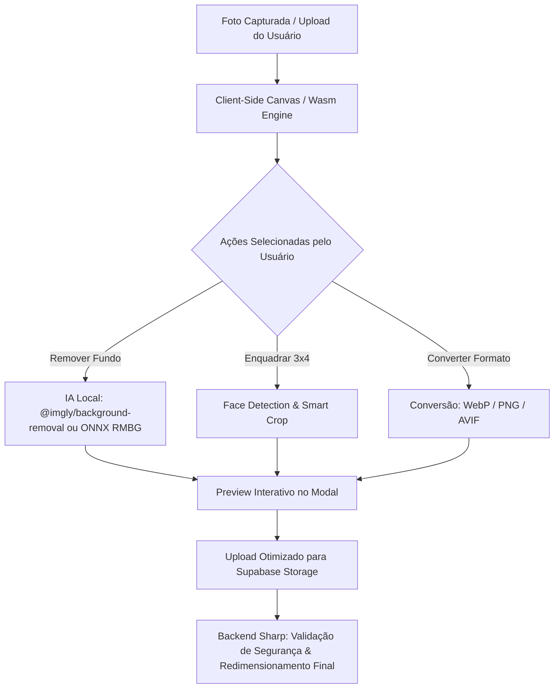

# Planos Futuros & Status de Implementação

Este arquivo armazena o roadmap oficial, planos de implementação futuros, ideias arquiteturais e melhorias estruturadas para o projeto SIG. Ele reflete o status real e sincronizado de todas as entregas e iniciativas do repositório.

**Última atualização:** 19 de Agosto de 2026

---

## 🗺️ Painel de Status Geral

| Plano / Recurso | Status | Data / Sessão | Observação & Entregas |
|---|:---:|:---:|---|
| **Compressão Segura de Fotos (Funcionários & Alunos)** | ✅ Implementado | 2026-08-19 | Normalização client-side (fotos até 20MB -> ~2MB), bypass Vercel 4.5MB com upload direto assinado, variantes WebP 3x4 via Sharp no backend, validação ABAC/RLS e unificação nas fichas de Alunos e Funcionários. |
| **Sistema de Logs & Auditoria Forense** | ✅ Implementado | 2026-08-18 | Trilha de navegação do usuário (`user_navigation_trail`), logs de requisições (`access_logs`), geolocalização de IPs (`ip_geolocation_cache`), rota `/api/admin/logs/detail` e interface avançada em `/admin/logs`. |
| **Módulo EMAEE (Atendimento Especializado)** | ✅ Implementado | 2026-08-16 | Prontuários clínicos, triagem, agendamento de atendimentos, vínculo de profissionais AEE, solicitações escola-EMAEE e upload de laudos anexos (`/emaee`). |
| **Portal do Aluno / Responsáveis** | ✅ Implementado | 2026-08-14 | Schema SQL, RLS blindado, toggle no Super Painel, menu dinâmico na Sidebar da Secretaria, gestão em `/responsaveis`, login próprio por e-mail/senha, troca de senha e dashboard em `/portal-aluno`. |
| **Módulo Calendário Acadêmico Oficial** | ✅ Implementado | 2026-08-05 | Gestão anual do calendário letivo da rede (`/calendario-academico`), cálculo automático de feriados nacionais/móveis (`feriadosNacionais.ts`), eventos/sábados letivos e auditoria em `calendario_historico`. |
| **Contas Especiais & Portal EJA** | ✅ Implementado | 2026-07-29 | Flag `is_conta_eja`, portal dedicado em `/eja`, isolamento de modalidades em relatórios, turmas, matrículas, ocorrências e redirecionamento no login. |
| **Filtro de Mapa Logístico, Camadas e Impressão** | ✅ Implementado | 2026-07-28 | Filtros de camadas em `MapaGlobal.tsx`, `MapaAlunos.tsx`, `relatorios/page.tsx` e impressão com `MapaImpressao.tsx` e `print-relatorio-geolocalizacao.tsx`. |
| **Importador Inteligente de Alunos via Excel** | ✅ Implementado | 2026-07-28 | Modal `modal-importar-excel.tsx` e utilitário `excelStudentParser.ts` para carga em lote com mapeamento de colunas. |
| **Sistema de Expurgo Seguro & Auditoria da Lixeira** | ✅ Implementado | 2026-07-28 | Rotas de hard-delete `/api/admin/hard-delete`, `archive-agent.ts`, `audit-agent.ts` e gestão de lixeira virtual em `/admin/lixeira`. |
| **Otimização de Exportações de Banco & Painel do Chefe** | ✅ Implementado | 2026-07-28 | Rota `/api/admin/export`, otimizações SQL/UI em `/admin/banco` e dashboard de plantões em `/painel-chefe`. |
| **Módulo de Transporte Escolar Completo** | ✅ Implementado | 2026-07-23 | Tabelas SQL, 5 abas em `/admin/transporte`, modais de abastecimento, manutenção de veículos e enturmação de alunos em rotas. |
| **Módulo Secretário de Educação & Limpeza Boletim** | ✅ Implementado | 2026-07-23 | Tabela `configuracoes_rede`, modal `/admin/escolas`, integração com cabeçalho oficial de boletins e relatórios. |
| **Resiliência e Ajuste de Mapas** | ✅ Implementado | 2026-07-22 | Tiles Leaflet atualizados com fallbacks resilientes (`MapaAlunos`, `MapaAuditoria`, `MapaGlobal`, `MiniMapa`). |
| **Integração Resend + Primeiro Acesso** | ✅ Implementado | 2026-07-21 | Rota `/primeiro-acesso`, interceptação no `proxy.ts`, validação de senha forte e sincronização no `PerfilTab.tsx`. |
| **Verificação QR Code / Crachá de Funcionário** | ✅ Implementado | 2026-07-20 | Rota pública `/verificar/funcionario/[id]` com validação instantânea de autenticidade do servidor. |
| **Central de Notificações e Atividades da Secretaria** | ✅ Implementado | 2026-07-20 | Notificações in-app com suporte a `grupo_id`, modais de diários pedagógicos e histórico em `/historico-notificacoes`. |
| **Otimização `/configuracoes` (40KB → 8-12KB)** | ✅ Implementado | 2026-07-18 | Código modularizado em Server Component + abas lazy, 8 erros silenciosos eliminados. |
| **Refatoração e Otimização `modal-aluno.tsx`** | ✅ Implementado | 2026-07-18 | Formulário modularizado com React Context e hooks (`AlunoFormContext`), divisão em 5 seções limpas. |
| **Refatoração e Otimização `modal-funcionario.tsx`** | ✅ Implementado | 2026-07-18 | Formulário modularizado com `FuncionarioFormContext`, dividido em 6 abas leves. |
| **Tabs Geolocalização (Funcionários + Alunos)** | ✅ Implementado | 2026-07-18 | `MapaAlunos.tsx` criado, integrado ao `MapWrapper` e `/relatorios`. |
| **Otimização da Página de Ajuda (`/ajuda`)** | ✅ Implementado | 2026-07-18 | 8 gargalos de performance e 7 erros silenciosos corrigidos. |
| **Otimização de Telas e Listagens (Alunos/Funcionários)** | ✅ Implementado | 2026-07-18 | Imports dinâmicos (`dynamic` sem SSR) para modais e relatórios de impressão física. |
| **Skill `otimizador`** | ✅ Implementado | 2026-07-18 | Skill de auditoria de performance criada em `.agents/skills/otimizador/SKILL.md`. |
| **Estúdio de Imagens IA & Conversão Autônoma (Zero SaaS)** | ⏳ Pendente | 2026-08-19 | Remoção de fundo por IA client-side (Wasm/ONNX), conversão multiformato (WebP/PNG/AVIF) e enquadramento 3x4 automático com custo zero e conformidade LGPD. |
| **Acesso Rápido por Biometria Mobile (WebAuthn / Passkeys)** | ⏳ Pendente | 2026-08-15 | Autenticação biométrica instantânea (Face ID / Impressão Digital) via WebAuthn/FIDO2 no celular para servidores e pais. |
| **Hardening de RLS em Produção & Limpeza de Dev Policies** | ⏳ Pendente | 2026-07-24 | Remoção progressiva de `dev_all_authenticated` em tabelas críticas (Alunos, Notas, Frequências) e isolamento estrito ABAC por escola/cargo. |
| **Módulo Roteiro e Paradas (Motoristas Nível 6)** | ⏳ Pendente | 2026-07-23 | Roteiro de paradas, geolocalização e confirmação de embarque/desembarque de alunos para contas nível 6. |
| **Assistente de IA para Logs de Auditoria** | ⏳ Pendente | 2026-07-20 | Mini assistente inteligente para consultas em linguagem natural sobre histórico de auditoria e segurança. |
| **Índices Compostos & Agregações Server-Side (Escala 3k)** | ⏳ Pendente | 2026-07-24 | Índices compostos de busca `alunos(escola_id, nome)`, contadores agregados e paginação server-side para rede de 3.000 alunos. |

---

## 🎯 Planos Futuros Estruturados (Roadmap Ativo)

---

### 📌 1. Estúdio de Imagens IA & Conversão Autônoma (Zero SaaS / Custo Zero)

> **Status:** ⏳ Pendente — Proposto em 2026-08-19  
> **Prioridade:** Média-Alta (Extensão direta da infraestrutura de fotos concluída)  
> **Objetivo:** Expandir a infraestrutura nativa de imagens do SIG para incluir **Remoção Inteligente de Fundo por IA (Client-Side via Wasm/ONNX)**, **Conversão Multiformato Dinâmica (WebP, PNG, JPG, AVIF)** e **Enquadramento Biométrico 3x4 Automático**, operando 100% no navegador do usuário e servidor local com **custo zero recorrente** e **conformidade total com a LGPD**.

#### 💡 Proposta de Valor & Diferenciais
1. **Economia Recorrente de Custos (Substituição de SaaS Pagos)**:
   - Elimina a necessidade de assinar serviços externos de recorte e manipulação (como *Remove.bg*, *Cloudinary*, *Imgix* ou *TinyPNG*), que custam entre R$ 0,50 e R$ 2,00 por foto processada ou planos corporativos de US$ 99 a US$ 500+/mês.
2. **Privacidade e Conformidade Estrita com a LGPD**:
   - Fotos de alunos (menores de idade) e servidores públicos **nunca saem do dispositivo ou do servidor seguro do município**. Nenhuma imagem é transferida para servidores de terceiros ou APIs de nuvem externas.
3. **Padronização Visual Profissional Instantânea**:
   - **Fotos 3x4 Oficiais:** Remove ruídos, fundos residenciais ou poluídos e aplica fundo branco ou azul padrão de identificação civil em 1 clique.
   - **Crachás e Carteirinhas:** Gera imagens com fundo transparente (PNG) ou alta compressão (WebP) para crachás de servidores e carteirinhas digitais de estudantes.
4. **Conversão Multiformato e Compressão Extrema**:
   - Suporte bidirecional para converter entre **JPEG, PNG, WebP e AVIF**, permitindo uploads de qualquer tipo de arquivo (câmeras de celular, scanners antigos, capturas de tela) com padronização automática e redução de até 95% no espaço em disco.

#### 🛠️ Checklist de Execução
- [ ] Avaliar e testar a biblioteca `@imgly/background-removal` em ambiente Next.js 16.
- [ ] Criar componente de estúdio de foto (`src/components/ui/photo-studio-modal.tsx`) com opções de:
  - Alternar fundo: Original, Transparente, Branco 3x4, Azul Oficial.
  - Enquadramento automático no rosto (Face Crop).
  - Ajuste fino de brilho e contraste antes de salvar.
- [ ] Integrar o estúdio nos formulários de cadastro:
  - Ficha do Aluno (`modal-aluno`)
  - Ficha do Funcionário (`modal-funcionario`)
  - Cadastro de Pacientes EMAEE (`/emaee/pacientes`)
- [ ] Adicionar suporte a exportação direta de crachás com fundo transparente nas rotas de impressão.
- [ ] Validar tempo de processamento em celulares e computadores com processadores modestos.
- [ ] Validar compilação sem erros com `npx tsc --noEmit`.

---

### 📌 2. Acesso Rápido por Biometria Mobile (WebAuthn / Passkeys)

> **Status:** ⏳ Pendente — Proposto em 2026-08-15  
> **Prioridade:** Média  
> **Objetivo:** Permitir que servidores, professores, gestores e responsáveis realizem login instantâneo no celular via Face ID ou Impressão Digital através do padrão W3C WebAuthn / FIDO2 / Passkeys, reduzindo o tempo de login de ~15 segundos para ~1 segundo.  
> **Tabelas de banco envolvidas / propostas:** `public.biometria_dispositivos` (nova)

#### 💡 Arquitetura Técnica & Segurança
1. **Padrão WebAuthn / Passkeys (W3C)**:
   - Utilização de `@simplewebauthn/browser` (front-end) e `@simplewebauthn/server` (back-end).
   - O dado biométrico (digital/rosto) **nunca sai do dispositivo** do usuário e nunca trafega pela rede (conformidade estrita com LGPD).
   - O chip de segurança do aparelho (Secure Enclave no iOS / Titan/TrustZone no Android) assina desafios criptográficos (*challenges*) temporários enviados pelo servidor.
2. **Modelagem SQL Proposta (`public.biometria_dispositivos`)**:
   - `id`: `uuid` (PK)
   - `funcionario_id`: `uuid` (FK -> `public.funcionarios.id`, Nullable)
   - `auth_user_id`: `uuid` (FK -> `auth.users.id`, NOT NULL)
   - `credential_id`: `text` (Identificador único da credencial FIDO2)
   - `public_key`: `text` (Chave pública para validação de assinaturas)
   - `counter`: `bigint` (Contador de uso para proteção contra replay attacks)
   - `dispositivo_nome`: `text` (Ex: "iPhone 14 - Safari", "Galaxy S23 - Chrome")
   - `transports`: `text[]` (Ex: `['internal', 'hybrid']`)
   - `ultimo_uso`: `timestamptz` (Registro do último login biométrico)
   - `created_at`: `timestamptz` (Default `now()`)
3. **Políticas de RLS**:
   - Cada usuário autenticado pode listar e excluir apenas seus próprios dispositivos biométricos (`auth_user_id = auth.uid()`).
4. **Experiência do Usuário (UX)**:
   - **Primeiro Login:** Usuário entra normalmente com e-mail e senha. O sistema detecta suporte a `window.PublicKeyCredential` e exibe: *"Deseja ativar o acesso rápido por biometria neste celular?"*.
   - **Próximos Acessos:** A tela de login exibe um botão de destaque *"Entrar com Biometria"* com o ícone de digital/Face ID. O toque aciona o leitor biométrico do aparelho e autentica imediatamente.
   - **Gerenciamento:** Na aba de Perfil (`/perfil`), o usuário pode ver todos os aparelhos cadastrados e revogar o acesso de qualquer dispositivo.
   - **Fallback:** Login tradicional por e-mail e senha sempre disponível como alternativa.

#### 🛠️ Checklist de Execução
- [ ] Instalar pacotes `@simplewebauthn/browser` e `@simplewebauthn/server`.
- [ ] Criar migration Supabase com tabela `public.biometria_dispositivos` e políticas RLS restritas.
- [ ] Criar rotas de API para geração e validação de desafios:
  - `src/app/api/auth/biometria/registro-options/route.ts`
  - `src/app/api/auth/biometria/registro-verify/route.ts`
  - `src/app/api/auth/biometria/login-options/route.ts`
  - `src/app/api/auth/biometria/login-verify/route.ts`
- [ ] Integrar botão e fluxo biométrico na tela de login (`src/app/(auth)/login/page.tsx`).
- [ ] Criar aba / card "Dispositivos & Biometria" em `PerfilTab.tsx` para cadastro e revogação.
- [ ] Validar compilação com `npx tsc --noEmit`.

---

### 📌 3. Módulo de Roteiro e Paradas de Transporte Escolar (Motoristas - Nível 6)

> **Status:** ⏳ Pendente — Proposto em 2026-07-23  
> **Prioridade:** Média  
> **Objetivo:** Desenvolver uma interface web/PWA mobile otimizada para motoristas escolares (contas de acesso Nível 6) para acompanhamento em tempo real do roteiro de transporte, visualização da sequência de paradas, lista de alunos por ponto de embarque/desembarque e registro do diário de bordo da viagem.  
> **Tabelas de banco envolvidas / propostas:** `public.rotas_transporte`, `public.veiculos`, `public.alunos_transporte`, `public.historico_viagens_transporte` (nova)

#### 🛠️ Checklist de Execução
- [ ] **Modelagem e RLS**: Configurar políticas de RLS no Supabase liberando acesso de leitura/escrita condicionado a contas de Nível 6 (`acessos_usuarios.nivel = 6`) apenas para as rotas e veículos atribuídos ao motorista autenticado (`veiculos.motorista_id = funcionario.id`).
- [ ] **Interface Mobile / PWA para Motoristas**: Criar visualização dedicada responsiva com botões de alto contraste, tipografia adaptada para uso mobile e operação facilitada no veículo.
- [ ] **Sequenciamento de Roteiro e Paradas**: Exibir o itinerário sequencial das paradas (`pontos_parada` jsonb) da rota vinculada com horários previstos e integração com Google Maps / Waze (deep links de navegação GPS).
- [ ] **Lista e Checklist de Alunos por Parada**: Exibir a relação de alunos alocados em cada ponto (`public.alunos_transporte`), com opção de marcar presença/embarque e desembarque no ponto da escola ou residência.
- [ ] **Diário de Bordo & Leitura de Hodômetro**: Modal/Formulário rápido para o motorista registrar o início da viagem (quilometragem inicial), intercorrências no percurso (ex: atrasos, desvios) e finalização da viagem (quilometragem final e confirmação de chegada).
- [ ] **Histórico e Relatórios de Viagem**: Tabela `public.historico_viagens_transporte` para auditoria de horários cumpridos, total de alunos transportados por dia/turno e acompanhamento pela gestão de transporte (Nível 1 a 5 / Admin).

---

### 📌 4. Assistente de IA de Auditoria (Audit Logs)

> **Status:** ⏳ Pendente — Proposto em 2026-07-20  
> **Prioridade:** Baixa-Média  
> **Objetivo:** Criar um assistente inteligente integrado ao painel administrativo capaz de responder perguntas em linguagem natural sobre o histórico de alterações no sistema (ex: *"quem desativou o vínculo da secretária?"*, *"quando a turma X foi alterada?"*).  
> **Tabelas de banco envolvidas:** `public.audit_logs`, `public.user_navigation_trail`, `public.access_logs`

#### 💡 Possibilidades de Arquitetura (Gratuitas, Leves e Restritas ao SIG)
1. **Opção A: Google Gemini API (Plano Gratuito) + Vercel AI SDK (Recomendada)**
   - **Stack:** `@ai-sdk/google` + Modelo `gemini-1.5-flash` ou `gemini-2.0-flash`.
   - **Vantagens:** Nível gratuito generoso (15 requisições/minuto), processamento rápido, integração nativa com Route Handlers do Next.js 16 (`src/app/api/admin/audit-chat/route.ts`).
   - **Restrição ao SIG:** O endpoint injeta um System Prompt restrito com o schema do banco + consulta dinâmica (RAG) dos registros em `public.audit_logs`.
2. **Opção B: Groq API (Modelos Open-Source Gratuitos & Ultra Rápidos)**
   - **Stack:** `@ai-sdk/openai` apontando para a API da [Groq](https://groq.com) executando `Llama-3-8B-Instruct` ou `Gemma-2-9B`.
   - **Vantagens:** Gratuito, latência de inferência extremamente baixa (< 0.5s) e sem peso no bundle do cliente.
3. **Opção C: Modelos 100% Locais no Navegador (WebLLM / Transformers.js)**
   - **Stack:** `@mlc-ai/web-llm` ou `@xenova/transformers` executando modelos ultra-leves (ex: `SmolLM-135M` ou `Phi-3 Mini` de ~100MB a 500MB via WebGPU).
   - **Vantagens:** Custo zero absoluto, privacidade total (nenhum dado de auditoria sai do navegador do admin).

#### 🛠️ Checklist de Execução
- [ ] Escolher e configurar uma das abordagens acima (Recomendada: Opção A - Gemini Flash via Vercel AI SDK).
- [ ] Modelar a API de busca/filtragem de dados estruturados na tabela `public.audit_logs`.
- [ ] Criar endpoint seguro `/api/admin/audit-chat` com injeção de contexto/schema restrito ao SIG.
- [ ] Desenvolver a interface visual do mini assistente de chat no painel administrativo (`src/app/(dashboard)/admin/page.tsx`).
- [ ] Garantir conformidade com as regras de permissões (apenas usuários de nível elevado como Superadmin ou Direção com RLS estrito).

---

### 📌 5. Hardening de Segurança RLS em Produção & Remoção de Políticas de Dev (P0)

> **Status:** ⏳ Pendente — Diagnosticado na Auditoria de Escala (2026-07-24)  
> **Prioridade:** Alta (Segurança Pré-Produção em Massa)  
> **Objetivo:** Remover as políticas permissivas `dev_all_authenticated` das tabelas centrais do banco, substituindo-as por políticas estritas baseadas em ABAC (`acessos_usuarios`), escola vinculada e papel de acesso.

#### 💡 Diagnóstico e Riscos
- No PostgreSQL, políticas permissivas são combinadas por operador lógico **OU** (`OR`). Portanto, a presença de uma política `dev_all_authenticated` com `FOR ALL USING (auth.role() = 'authenticated')` anula as regras restritivas específicas de escola, turma ou cargo.
- **Tabelas prioritárias para substituição:** `alunos`, `funcionarios`, `frequencias`, `notas`, `turmas`, `agenda_aulas`, `vinculos_turmas`, `atividades_secretaria`, `alunos_transporte`.

#### 🛠️ Checklist de Execução
- [ ] Mapear matriz de permissões por cargo para cada tabela core do sistema.
- [ ] Criar migration de transição removendo `dev_all_authenticated` tabela por tabela.
- [ ] Testar cenários de acesso: Professor (apenas suas turmas/notas), Secretário (apenas sua escola), Motorista (apenas sua rota) e Superadmin (visão global).
- [ ] Garantir que chamadas de sistema utilizem `supabaseAdmin` com Service Role nas rotas de API seguras (`src/app/api/`).

---

### 📌 6. Índices Compostos & Agregações Server-Side para Escala de 3.000 Alunos

> **Status:** ⏳ Pendente — Proposto em 2026-07-24  
> **Prioridade:** Média  
> **Objetivo:** Preparar o banco de dados Supabase para comportar dezenas de acessos simultâneos e consultas de milhares de registros sem degradação de tempo de resposta.

#### 💡 Índices Compostos Propostos
- `CREATE INDEX idx_alunos_escola_nome ON public.alunos (escola_id, nome) WHERE deleted_at IS NULL;` (otimização de buscas paginadas e autocomplete por escola)
- `CREATE INDEX idx_notifications_user_unread ON public.notifications (user_id, read) WHERE read = false;` (contador de notificações no cabeçalho)
- `CREATE INDEX idx_notas_escola_aluno ON public.notas (aluno_id, materia_id, unidade);` (cálculo de boletins e relatórios consolidados)
- `CREATE INDEX idx_performance_metrics_name_date ON public.performance_metrics (metric_name, created_at DESC);` (agregações de telemetria)

#### 🛠️ Checklist de Execução
- [ ] Analisar planos de execução com `EXPLAIN (ANALYZE, BUFFERS)` nas consultas de listagem mais frequentes.
- [ ] Criar migration Supabase com os novos índices compostos parciais.
- [ ] Converter consultas pesadas de relatórios para RPCs de agregação server-side no Postgres.

---

## ✅ Histórico Completo de Implementações Concluídas

---

### 🗓️ 2026-08-19

#### 📷 Compressão Segura de Fotos (Funcionários & Alunos)
- **O que foi feito:** Refatoração completa do pipeline de fotos no cadastro de Alunos e Funcionários, eliminando erros de payload da Vercel (limite de 4.5MB), otimizando a largura de banda e padronizando o armazenamento em formato WebP 3x4.
- **Entregas e Correções:**
  - **Compressão Client-Side Automática:** Imagens capturadas por câmeras de alta resolução (até 20MB) são redimensionadas no navegador do usuário para ~2MB antes do envio, preservando a nitidez sem sobrecarregar a conexão.
  - **Upload Direto Assinado (Bypass Vercel):** Implementada rota `/api/fotos/presigned-url` que gera URLs pré-assinadas para envio direto ao Supabase Storage, eliminando erros `413 Payload Too Large`.
  - **Processamento Backend com Sharp:** Endpoint `/api/fotos/process` gera variantes otimizadas em WebP no formato oficial 3x4 (300x400px), reduzindo o peso por foto para ~20KB a 40KB.
  - **Sessão Timestamp Anti-Flickering:** Implementado timestamp de sessão nos componentes para evitar downloads repetidos e cintilação de tela.
- **Arquivos criados/modificados:** `src/app/api/fotos/presigned-url/route.ts` · `src/app/api/fotos/process/route.ts` · `src/components/modals/modal-aluno/components/SecaoIdentificacao.tsx` · `src/components/modals/modal-funcionario/components/PessoaisTab.tsx` · `src/components/modals/modal-funcionario/hooks/useFuncionarioFormStates.ts`

---

### 🗓️ 2026-08-18

#### 🔍 Sistema de Logs Avançado, Trilha de Navegação e Auditoria Forense
- **O que foi feito:** Criação da central unificada de auditoria e segurança administrativa em `/admin/logs`, permitindo aos gestores e superadmins inspecionar ações de usuários, acessos, requisições HTTP e eventos críticos do sistema.
- **Entregas e Correções:**
  - **Trilha de Navegação:** Registro detalhado do caminho de telas percorrido por cada usuário autenticado (`public.user_navigation_trail`).
  - **Logs de Acesso HTTP & Geolocation:** Armazenamento de requisições (`public.access_logs`) e cache de localização geográfica de IPs (`public.ip_geolocation_cache`).
  - **Endpoint de Detalhes de Logs:** Rota segura `/api/admin/logs/detail` para inspeção profunda de payloads, diffs de alteração e metadados de sessão.
- **Arquivos criados/modificados:** `src/app/(dashboard)/admin/logs/page.tsx` · `src/app/api/admin/logs/detail/route.ts` · `src/lib/audit/`

---

### 🗓️ 2026-08-16

#### 🏥 Módulo EMAEE (Atendimento Educacional Especializado)
- **O que foi feito:** Desenvolvimento do módulo de acolhimento e prontuário clínico multidisciplinar para estudantes com deficiência, TEA e necessidades especiais.
- **Entregas e Correções:**
  - **Gestão de Pacientes & Prontuários:** Cadastro clínico, histórico de evoluções médicas/pedagógicas e emissão de pareceres (`/emaee/pacientes`).
  - **Agendamento de Atendimentos:** Calendário integrado de sessões com psicólogos, psicopedagogos e fonoaudiólogos (`/emaee/calendario-atendimentos`).
  - **Fila de Espera & Triagem:** Gestão de solicitações encaminhadas pelas escolas municipais (`/emaee/fila-espera` e `/emaee/solicitacoes-escola`).
  - **Vínculo de Profissionais AEE:** Mapeamento de especialistas e terapeutas vinculados (`/emaee/vincular-profissionais`).
- **Arquivos criados/modificados:** `src/app/(dashboard)/emaee/**` · `public.emaee_*` (tabelas e RLS).

---

### 🗓️ 2026-08-14

#### 👨‍👩‍👦 Portal do Aluno & Gestão de Responsáveis
- **O que foi feito:** Construção do portal isolado para pais e responsáveis legais acompanharem a vida escolar dos estudantes, com canal de comunicação e requerimentos.
- **Entregas e Correções:**
  - **Gestão de Responsáveis pela Secretaria:** Tela administrativa em `/responsaveis` para cadastro presencial, vínculo familiar com alunos e geração de senha temporária.
  - **Login e Troca Obrigatória:** Rota de autenticação exclusiva `/portal-aluno/login` e tela bloqueante `/portal-aluno/trocar-senha`.
  - **Dashboard do Estudante:** Visão de boletim, médias, notas por trimestre e frequências em `/portal-aluno/dashboard`.
  - **Ocorrências com Confirmação de Ciência:** Pais podem ler e assinar eletronicamente a ciência de advertências/ocorrências disciplinares (`/portal-aluno/ocorrencias`).
  - **Canal de Comunicações & Solicitações:** Troca de recados com professores e solicitação de documentos e declarações escolares (`/portal-aluno/comunicacoes` e `/portal-aluno/solicitacoes`).
- **Arquivos criados/modificados:** `src/app/portal-aluno/**` · `src/app/(dashboard)/responsaveis/**` · `src/app/api/admin/responsaveis/route.ts` · `src/proxy.ts`

---

### 🗓️ 2026-08-05

#### 📅 Módulo Calendário Acadêmico Oficial da Rede
- **O que foi feito:** Desenvolvimento da ferramenta de planejamento e controle do calendário letivo municipal para a Secretaria de Educação e Administração.
- **Entregas e Correções:**
  - **Cálculo Automático de Feriados:** Utilitário `src/lib/feriadosNacionais.ts` que calcula feriados fixos e datas móveis (Carnaval, Páscoa, Corpus Christi) para qualquer ano letivo.
  - **Interface Interativa do Calendário:** Visualização em grade e lista de dias letivos, recessos, pontos facultativos e sábados letivos (`/calendario-academico`).
  - **Trilha de Auditoria:** Histórico completo de alterações nas datas oficiais da rede em `public.calendario_historico`.
- **Arquivos criados/modificados:** `src/app/(dashboard)/calendario-academico/page.tsx` · `src/hooks/useCalendarioAcademico.ts` · `src/lib/feriadosNacionais.ts` · `public.calendarios_academicos` · `public.calendario_eventos`

---

### 🗓️ 2026-07-29

#### 🎓 Contas Especiais & Portal EJA (Educação de Jovens e Adultos)
- **O que foi feito:** Criação de perfil de acesso especializado e portal exclusivo para a modalidade de Educação de Jovens e Adultos.
- **Entregas e Correções:**
  - **Flag `is_conta_eja`:** Identificação de servidores com lotação exclusiva no EJA.
  - **Portal Dedicado `/eja`:** Sub-rotas especializadas para alunos, turmas, avaliações e matrículas do EJA, sem mistura com o ensino regular.
  - **Isolamento em Relatórios e Filtros:** Separação das matrizes curriculares e turnos noturnos.
- **Arquivos criados/modificados:** `src/app/(dashboard)/eja/**` · `src/store/useAuthStore.ts` · `src/app/(dashboard)/home/page.tsx` · `src/app/(dashboard)/relatorios/page.tsx`

---

### 🗓️ 2026-07-28

#### 🗺️ Mapas Logísticos, Importador Excel e Gestão da Lixeira
- **O que foi feito:** Conjunto de aprimoramentos para gestão em massa, geolocalização e segurança de dados.
- **Entregas e Correções:**
  - **Camadas e Impressão de Mapas:** Filtros por escola, rota e perfil nos componentes `MapaGlobal.tsx`, `MapaAlunos.tsx` e `MapaImpressao.tsx`.
  - **Importador Inteligente Excel:** Upload de planilhas `.xlsx` com mapeamento automático de colunas e validação prévia de duplicidades via `excelStudentParser.ts`.
  - **Expurgo Seguro da Lixeira:** Rota `/api/admin/hard-delete` com verificação de papéis e logs de auditoria antes da exclusão física de registros da lixeira virtual (`/admin/lixeira`).
  - **Exportação de Backups:** Rota `/api/admin/export` para geração rápida de dumps estruturados do banco.
- **Arquivos criados/modificados:** `src/components/modals/modal-importar-excel.tsx` · `src/lib/excelStudentParser.ts` · `src/app/api/admin/hard-delete/route.ts` · `src/app/api/admin/export/route.ts`

---

### 🗓️ 2026-07-23

#### 🚌 Módulo de Transporte Escolar & Configurações da Rede
- **O que foi feito:** Sistema completo de gestão da frota municipal de transporte e parametrização da Secretaria de Educação.
- **Entregas e Correções:**
  - **5 Abas em `/admin/transporte`:** Veículos, Motoristas, Rotas, Abastecimentos e Manutenções.
  - **Enturmação de Alunos em Rotas:** Vínculo de estudantes com paradas e rotas de transporte escolar (`public.alunos_transporte`).
  - **Tabela `configuracoes_rede`:** Parametrização do nome do Secretário(a), logos oficiais e cabeçalhos de boletins.
- **Arquivos criados/modificados:** `src/app/(dashboard)/admin/transporte/**` · `src/app/(dashboard)/admin/escolas/**` · `public.veiculos` · `public.rotas_transporte`

---

### 🗓️ 2026-07-22

#### 🛰️ Resiliência dos Componentes de Mapas (Leaflet)
- **O que foi feito:** Atualização de todos os componentes de mapa para utilizar fallbacks resilientes de tiles de satélite e vetoriais, eliminando travamentos de carregamento em redes lentas.
- **Arquivos modificados:** `MapaAlunos.tsx` · `MapaAuditoria.tsx` · `MapaGlobal.tsx` · `MiniMapa.tsx`

---

### 🗓️ 2026-07-21

#### 🔐 Troca Obrigatória de Senha no Primeiro Acesso (`/primeiro-acesso`)
- **O que foi feito:** Fluxo interceptor de primeiro acesso para forçar a troca de senha padrão gerada pela secretaria no primeiro login do servidor.
- **Arquivos criados/modificados:** `src/app/(auth)/primeiro-acesso/page.tsx` · `src/proxy.ts` · `src/app/(auth)/login/page.tsx` · `src/app/(dashboard)/configuracoes/PerfilTab.tsx`

---

### 🗓️ 2026-07-20

#### 🪪 Verificação Pública de Crachá/QR Code de Servidores
- **O que foi feito:** Criação da rota pública `/verificar/funcionario/[id]` para leitura e autenticação de crachás por QR Code.
- **Ajustes de Notificações:** Refatoração dos modais de diários pedagógicos e histórico em `/historico-notificacoes`.
- **Arquivos criados/modificados:** `src/app/verificar/funcionario/[id]/page.tsx` · `modal-notificacoes.tsx` · `modal-nova-atividade.tsx`

---

### 🗓️ 2026-07-18

#### ⚡ Otimização Estrutural de Performance & Refatoração de Modais
- **O que foi feito:** Auditoria profunda e refatoração de componentes de alta complexidade para eliminar gargalos e erros silenciosos.
- **Entregas e Correções:**
  - **Otimização `/configuracoes`:** Redução de bundle de 40KB para ~10KB, dividindo em Server Component e abas lazy (`PerfilTab`, `GradeCurricularTab`, `SessoesAtivasTab`).
  - **Refatoração `modal-aluno.tsx`:** Modularização do arquivo monolítico de 90KB em contexto `AlunoFormContext` e 5 sub-seções leves.
  - **Refatoração `modal-funcionario.tsx`:** Modularização do formulário em `FuncionarioFormContext` e 6 abas de dados (`PessoaisTab`, `SaudeTab`, `EscolaridadeTab`, `EmpregoTab`, `DocumentosTab`, `AnexosTab`).
  - **Tabs de Geolocalização:** Criação de `MapaAlunos.tsx` e integração dinâmica no `MapWrapper`.
  - **Otimização da Página `/ajuda`:** Eliminação de 8 gargalos e 7 erros silenciosos.
  - **Skill `otimizador`:** Criação da ferramenta de auditoria de performance em `.agents/skills/otimizador/SKILL.md`.
